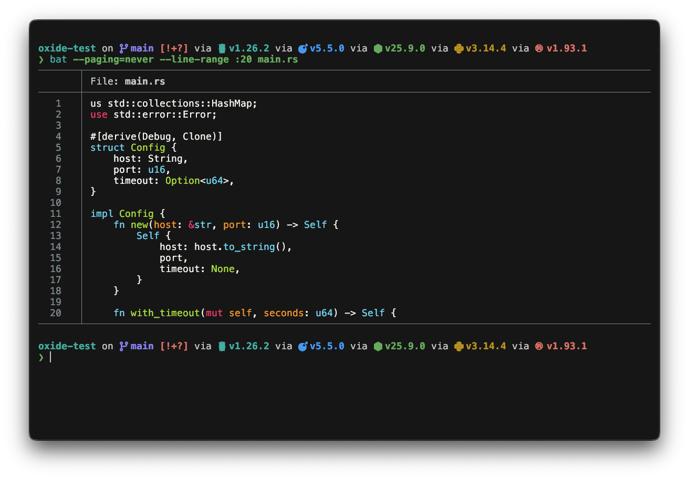

<div align="center">

# oxide for wezterm

</div>

<h6 align="center">
Where function meets form.
</h6>

<p align="center">
  <a href="https://github.com/oxidescheme/wezterm/stargazers"></a>
  <a href="https://github.com/oxidescheme/wezterm/issues"></a>
  <a href="https://discord.gg/p8GcbBH5MR"></a>
</p>

<p align="center">
  
</p>

oxide colorscheme for [wezterm](https://wezterm.org/).

## Installation

1. Download `oxide.toml` from this repository
2. Copy it to your wezterm config directory: `~/.config/wezterm/colors/`
3. Set the scheme in your `wezterm.lua`:

```lua
return {
  color_scheme = "oxide",
}
```

## Contributing

PRs welcome. Make sure colors match the palette in the [main repo](https://github.com/oxidescheme/oxide).

## Credits

- **Port Creator:** [@jakmaz](https://github.com/jakmaz)
- **Current Maintainer:** [@jakmaz](https://github.com/jakmaz)
- **Contributors:** See [contributors list](https://github.com/oxidescheme/wezterm/graphs/contributors)

## License

MIT License - see [LICENSE](LICENSE) for details.

<p align="center">
Copyright &copy; 2026-present oxidescheme
</p>
